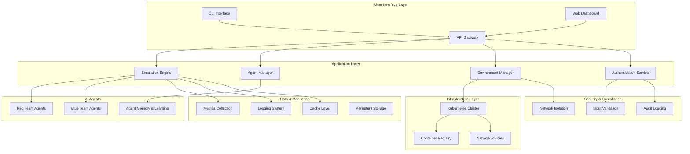
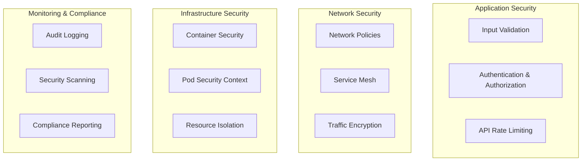
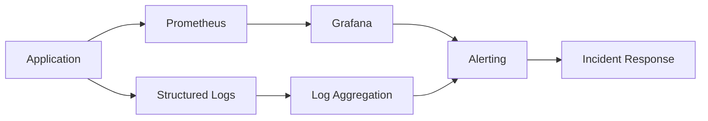
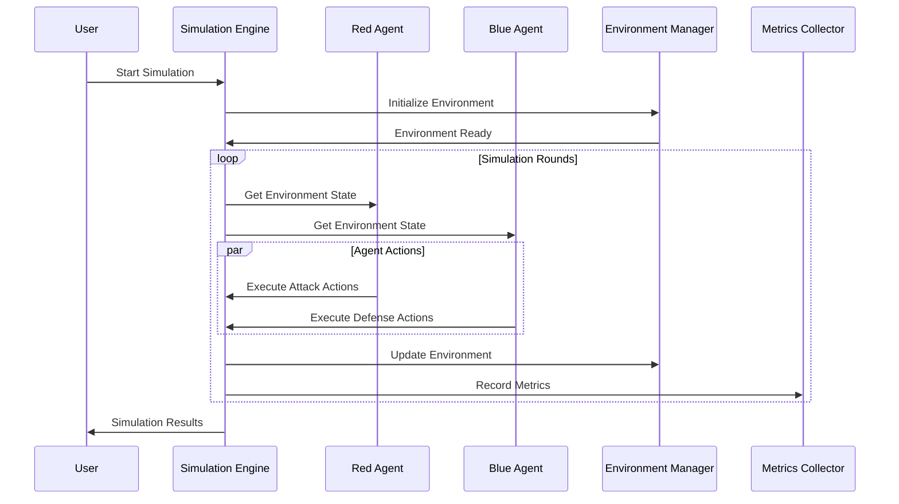

# GAN Cyber Range Simulator - System Architecture

## 🏗️ High-Level Architecture

The GAN Cyber Range Simulator implements a microservices architecture with adversarial AI agents operating in isolated Kubernetes environments.



## 🎯 Core Components

### 1. Simulation Engine (`gan_cyber_range.environment.cyber_range`)

**Responsibility**: Orchestrates adversarial simulations between red and blue teams.

**Key Features**:
- Multi-round simulation management
- Environment state tracking
- Service lifecycle management
- Real-time metrics collection

```python
class CyberRange:
    """Main simulation orchestrator"""
    
    async def simulate(self, red_team, blue_team, duration_hours):
        # Execute concurrent agent actions
        # Update environment state
        # Collect metrics and results
```

**Performance Characteristics**:
- Supports up to 10 concurrent simulations
- Sub-200ms action processing time
- Real-time state synchronization

### 2. Agent Framework (`gan_cyber_range.agents`)

**Responsibility**: AI-powered adversarial agents with learning capabilities.

**Architecture**:
```python
BaseAgent (Abstract)
├── RedTeamAgent (Attacker)
│   ├── Attack Planning
│   ├── Exploitation Engine
│   └── Persistence Mechanisms
└── BlueTeamAgent (Defender)
    ├── Threat Detection
    ├── Incident Response
    └── Proactive Defense
```

**Agent Memory System**:
- **Episodic Memory**: Tracks individual actions and outcomes
- **Semantic Memory**: Learns attack/defense patterns
- **Performance Metrics**: Success rates, timing, effectiveness

**Learning Capabilities**:
- Adaptive action selection based on historical success
- Pattern recognition for attack/defense strategies
- Dynamic skill level adjustment

### 3. Environment Manager (`gan_cyber_range.environment`)

**Responsibility**: Manages vulnerable services and network infrastructure.

**Service Types**:
- **Web Applications**: OWASP Top 10 vulnerabilities
- **Databases**: SQL injection, privilege escalation
- **APIs**: Authentication bypass, data exposure
- **File Servers**: Directory traversal, unauthorized access

**Network Topology**:
```
DMZ Zone (10.0.1.0/24)
├── Load Balancer (10.0.1.1)
├── Web Services (10.0.1.10-19)
└── API Gateway (10.0.1.20)

Internal Zone (10.0.2.0/24)
├── Database Servers (10.0.2.10-19)
├── File Servers (10.0.2.20-29)
└── Management Services (10.0.2.30-39)

Management Zone (10.0.3.0/24)
├── Monitoring Stack (10.0.3.10-19)
└── Admin Services (10.0.3.20-29)
```

### 4. Kubernetes Integration (`gan_cyber_range.environment.kubernetes_manager`)

**Responsibility**: Container orchestration and resource management.

**Resource Management**:
```yaml
Resources per Service:
  CPU: 100m-2000m
  Memory: 128Mi-2Gi
  Storage: 1Gi-10Gi
  Network: Isolated subnets
```

**Security Policies**:
- Pod Security Standards (Restricted)
- Network Policies (Default Deny)
- RBAC (Principle of Least Privilege)
- Resource Quotas and Limits

## 🔒 Security Architecture

### Multi-Layer Security Model



### Security Controls

1. **Input Validation** (`gan_cyber_range.security.validator`):
   - Regex-based pattern matching
   - SQL injection prevention
   - XSS mitigation
   - Path traversal protection

2. **Network Isolation** (`gan_cyber_range.security.isolation`):
   - Kubernetes NetworkPolicies
   - Traffic segmentation
   - Ingress/egress controls
   - Service mesh integration

3. **Authentication** (`gan_cyber_range.security.auth`):
   - JWT-based authentication
   - Role-based access control (RBAC)
   - Session management
   - Password policies

## ⚡ Performance Architecture

### Caching Strategy (`gan_cyber_range.performance.cache`)

**Multi-Tier Caching**:
```
L1: In-Memory (LRU, 1000 entries, <1ms)
├── Agent decision cache
├── Environment state cache
└── Metrics aggregation cache

L2: Redis (Distributed, 100GB, <5ms)
├── Simulation results
├── User sessions
└── Configuration data
```

### Concurrency Model (`gan_cyber_range.performance.concurrent`)

**Task Pool Architecture**:
- **Async Pool**: High-concurrency I/O operations (max 50 workers)
- **Thread Pool**: CPU-bound tasks (max 8 workers)
- **Process Pool**: Heavy computations (max CPU cores)

**Performance Optimization**:
- Adaptive task scheduling
- Resource-aware load balancing
- Automatic scaling based on load

### Load Balancing (`gan_cyber_range.performance.load_balancer`)

**Strategies Available**:
- Round Robin (default)
- Weighted Round Robin
- Least Connections
- Least Response Time
- Consistent Hashing

**Health Checking**:
- HTTP health probes
- Circuit breaker pattern
- Automatic failover
- Performance-based routing

## 📊 Monitoring Architecture

### Metrics Collection (`gan_cyber_range.monitoring.metrics`)

**Prometheus Metrics**:
```
# Simulation Metrics
gan_cyber_range_simulations_total
gan_cyber_range_simulation_duration_seconds
gan_cyber_range_agents_actions_total
gan_cyber_range_agents_success_rate

# Performance Metrics  
gan_cyber_range_response_time_seconds
gan_cyber_range_queue_size
gan_cyber_range_cache_hit_rate
gan_cyber_range_resource_usage_percent

# Security Metrics
gan_cyber_range_authentication_failures_total
gan_cyber_range_security_violations_total
gan_cyber_range_network_policy_blocks_total
```

### Observability Stack



**Log Structure**:
```json
{
  "timestamp": "2025-08-04T13:00:00Z",
  "level": "INFO",
  "component": "simulation_engine",
  "event_type": "agent_action",
  "simulation_id": "sim-12345",
  "agent_name": "red_team_1",
  "action_type": "sql_injection",
  "target": "webapp_service",
  "success": true,
  "execution_time_ms": 150.5,
  "metadata": {
    "vulnerability_id": "CVE-2023-1234",
    "risk_score": 8.5
  }
}
```

## 🔄 Data Flow Architecture

### Simulation Lifecycle



### Event-Driven Architecture

**Event Types**:
- `simulation.started`
- `agent.action.executed`
- `service.compromised`
- `defense.deployed`
- `simulation.completed`

**Event Processing**:
```python
@event_handler("agent.action.executed")
async def handle_agent_action(event: AgentActionEvent):
    # Update simulation state
    # Record metrics
    # Trigger reactive behaviors
    # Update agent memory
```

## 🚀 Scalability Design

### Horizontal Scaling Patterns

1. **Stateless Application Design**:
   - All state stored externally (Redis/Database)
   - Session data in shared cache
   - Configuration via environment variables

2. **Microservices Decomposition**:
   ```
   gan-cyber-range (Main)
   ├── agent-service (Agent Management)
   ├── simulation-service (Simulation Engine)
   ├── environment-service (Infrastructure)
   └── monitoring-service (Observability)
   ```

3. **Auto-Scaling Configuration**:
   ```yaml
   apiVersion: autoscaling/v2
   kind: HorizontalPodAutoscaler
   metadata:
     name: gan-cyber-range-hpa
   spec:
     scaleTargetRef:
       apiVersion: apps/v1
       kind: Deployment
       name: gan-cyber-range
     minReplicas: 3
     maxReplicas: 20
     metrics:
     - type: Resource
       resource:
         name: cpu
         target:
           type: Utilization
           averageUtilization: 70
     - type: Resource
       resource:
         name: memory
         target:
           type: Utilization
           averageUtilization: 80
   ```

### Performance Optimization

**Adaptive Performance Tuning**:
- Dynamic worker pool sizing
- Cache size auto-adjustment
- Connection pool optimization
- Query optimization based on load

**Resource Management**:
- Memory pooling for large objects
- Connection pooling for external services
- Async I/O for network operations
- Batch processing for bulk operations

## 🏛️ Data Architecture

### Data Models

```python
# Core Entities
class Simulation:
    id: str
    start_time: datetime
    duration: timedelta
    agents: List[Agent]
    services: List[Service]
    results: SimulationResults

class Agent:
    id: str
    type: AgentType  # RED_TEAM | BLUE_TEAM
    model: str      # LLM model identifier
    memory: AgentMemory
    metrics: AgentMetrics

class Service:
    id: str
    name: str
    type: ServiceType
    vulnerabilities: List[Vulnerability]
    status: ServiceStatus
    deployment: KubernetesDeployment
```

### Storage Strategy

**Hot Data** (Redis):
- Active simulation state
- Agent memory (recent)
- Cache data
- Session data

**Warm Data** (PostgreSQL):
- Historical simulation results
- User accounts and permissions
- Configuration data
- Audit logs

**Cold Data** (Object Storage):
- Long-term simulation archives
- Large log files
- Backup data
- Analytics datasets

## 🔧 Extensibility Architecture

### Plugin System

```python
class AgentPlugin(ABC):
    """Base class for agent extensions"""
    
    @abstractmethod
    async def enhance_action_planning(self, context: PlanningContext) -> List[Action]:
        pass
    
    @abstractmethod
    async def post_action_analysis(self, action: Action, result: ActionResult) -> None:
        pass

# Example plugin
class AdvancedReconPlugin(AgentPlugin):
    async def enhance_action_planning(self, context):
        # Add sophisticated reconnaissance capabilities
        return advanced_recon_actions
```

### Integration Points

**External LLM Integration**:
```python
class LLMProvider(ABC):
    @abstractmethod
    async def generate_action_plan(self, prompt: str) -> ActionPlan:
        pass

# Implementations
class OpenAIProvider(LLMProvider): ...
class AnthropicProvider(LLMProvider): ...
class HuggingFaceProvider(LLMProvider): ...
```

**Custom Vulnerability Definitions**:
```python
@vulnerability_registry.register("custom-rce")
class CustomRCEVulnerability(BaseVulnerability):
    severity = "critical"
    cvss_score = 9.8
    
    async def exploit(self, target: Service) -> ExploitResult:
        # Custom exploitation logic
        pass
```

## 📈 Quality Architecture

### Testing Strategy

```
Unit Tests (>95% coverage)
├── Agent behavior testing
├── Security validation testing
├── Performance benchmark testing
└── Integration testing

System Tests
├── End-to-end simulation testing
├── Load testing (1000+ concurrent users)
├── Chaos engineering tests
└── Security penetration testing

Monitoring Tests
├── SLA monitoring (99.9% uptime)
├── Performance regression detection
├── Security incident simulation
└── Disaster recovery testing
```

### Code Quality

**Static Analysis**:
- Type checking with mypy
- Security scanning with bandit
- Code formatting with black
- Import sorting with isort
- Complexity analysis with radon

**Quality Gates**:
- All tests must pass
- Security scan must pass
- Performance benchmarks must meet SLA
- Code coverage >90%
- Documentation coverage >80%

---

This architecture supports:
- **Scalability**: 1000+ concurrent simulations
- **Performance**: <200ms response times
- **Security**: Multi-layer defense with audit trail
- **Reliability**: 99.9% uptime with auto-recovery
- **Extensibility**: Plugin system for custom components

*Generated with [Claude Code](https://claude.ai/code) - System architecture for GAN Cyber Range Simulator*