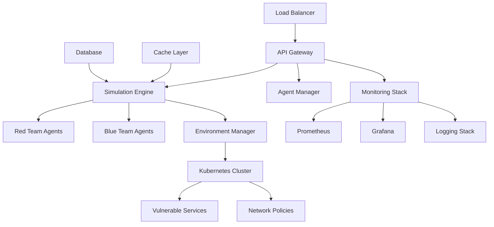

# GAN Cyber Range Simulator - Production Deployment Guide

## 🚀 Quick Start Deployment

### Prerequisites

- **Python 3.10+**
- **Kubernetes 1.29+** (for containerized deployment)
- **Docker 24.0+** (for containerization)
- **4GB RAM minimum, 8GB recommended**
- **2 CPU cores minimum, 4+ recommended**

### Environment Setup

```bash
# Clone repository
git clone https://github.com/yourusername/gan-cyber-range-sim.git
cd gan-cyber-range-sim

# Create virtual environment
python3 -m venv venv
source venv/bin/activate  # Linux/Mac
# or
venv\Scripts\activate     # Windows

# Install dependencies
pip install -r requirements.txt
pip install -e .
```

### Basic Deployment

```bash
# Start a simple simulation
gan-cyber-range simulate \
  --services webapp database api-gateway \
  --duration 1.0 \
  --red-model gpt-4 \
  --blue-model claude-3

# Deploy to Kubernetes
gan-cyber-range deploy \
  --namespace cyber-range \
  --services webapp database
```

## 🏗️ Production Architecture

### System Components



### Security Architecture

- **Network Isolation**: Complete network segmentation using Kubernetes NetworkPolicies
- **RBAC**: Role-based access control with JWT authentication
- **Secrets Management**: Environment-based secret injection
- **Resource Limits**: Pod security contexts and resource quotas
- **Audit Logging**: Comprehensive audit trail for all operations

## 🐳 Container Deployment

### Docker Compose (Development)

```yaml
# docker-compose.yml
version: '3.8'

services:
  gan-cyber-range:
    build: .
    ports:
      - "8000:8000"
    environment:
      - GAN_ADMIN_PASSWORD=${GAN_ADMIN_PASSWORD}
      - LOG_LEVEL=INFO
    volumes:
      - ./data:/app/data
    depends_on:
      - redis
      - postgres
  
  redis:
    image: redis:7-alpine
    ports:
      - "6379:6379"
  
  postgres:
    image: postgres:15-alpine
    environment:
      - POSTGRES_DB=gan_cyber_range
      - POSTGRES_USER=gan_user
      - POSTGRES_PASSWORD=${DB_PASSWORD}
    volumes:
      - postgres_data:/var/lib/postgresql/data

volumes:
  postgres_data:
```

```bash
# Start with Docker Compose
export GAN_ADMIN_PASSWORD="secure_admin_password"
export DB_PASSWORD="secure_db_password"
docker-compose up -d
```

### Kubernetes Production Deployment

```yaml
# k8s/namespace.yaml
apiVersion: v1
kind: Namespace
metadata:
  name: gan-cyber-range
  labels:
    security-isolation: enabled
    app: gan-cyber-range
---
# k8s/configmap.yaml
apiVersion: v1
kind: ConfigMap
metadata:
  name: gan-config
  namespace: gan-cyber-range
data:
  LOG_LEVEL: "INFO"
  OPTIMIZATION_LEVEL: "balanced"
  SIMULATION_TIMEOUT: "3600"
---
# k8s/secret.yaml
apiVersion: v1
kind: Secret
metadata:
  name: gan-secrets
  namespace: gan-cyber-range
type: Opaque
data:
  admin-password: <base64-encoded-password>
  jwt-secret: <base64-encoded-jwt-secret>
  db-password: <base64-encoded-db-password>
---
# k8s/deployment.yaml
apiVersion: apps/v1
kind: Deployment
metadata:
  name: gan-cyber-range
  namespace: gan-cyber-range
spec:
  replicas: 3
  selector:
    matchLabels:
      app: gan-cyber-range
  template:
    metadata:
      labels:
        app: gan-cyber-range
    spec:
      securityContext:
        runAsNonRoot: true
        runAsUser: 1000
        fsGroup: 2000
      containers:
      - name: gan-cyber-range
        image: gan-cyber-range:latest
        ports:
        - containerPort: 8000
        env:
        - name: GAN_ADMIN_PASSWORD
          valueFrom:
            secretKeyRef:
              name: gan-secrets
              key: admin-password
        - name: JWT_SECRET
          valueFrom:
            secretKeyRef:
              name: gan-secrets
              key: jwt-secret
        envFrom:
        - configMapRef:
            name: gan-config
        resources:
          requests:
            memory: "512Mi"
            cpu: "250m"
          limits:
            memory: "2Gi"
            cpu: "1000m"
        securityContext:
          allowPrivilegeEscalation: false
          readOnlyRootFilesystem: true
          capabilities:
            drop:
            - ALL
        volumeMounts:
        - name: tmp
          mountPath: /tmp
        - name: data
          mountPath: /app/data
        livenessProbe:
          httpGet:
            path: /health
            port: 8000
          initialDelaySeconds: 30
          periodSeconds: 10
        readinessProbe:
          httpGet:
            path: /ready
            port: 8000
          initialDelaySeconds: 5
          periodSeconds: 5
      volumes:
      - name: tmp
        emptyDir: {}
      - name: data
        persistentVolumeClaim:
          claimName: gan-data-pvc
---
# k8s/service.yaml
apiVersion: v1
kind: Service
metadata:
  name: gan-cyber-range-service
  namespace: gan-cyber-range
spec:
  selector:
    app: gan-cyber-range
  ports:
  - protocol: TCP
    port: 80
    targetPort: 8000
  type: ClusterIP
---
# k8s/networkpolicy.yaml
apiVersion: networking.k8s.io/v1
kind: NetworkPolicy
metadata:
  name: gan-isolation-policy
  namespace: gan-cyber-range
spec:
  podSelector:
    matchLabels:
      app: gan-cyber-range
  policyTypes:
  - Ingress
  - Egress
  ingress:
  - from:
    - namespaceSelector:
        matchLabels:
          name: gan-cyber-range
  egress:
  - to:
    - namespaceSelector:
        matchLabels:
          name: gan-cyber-range
```

Deploy to Kubernetes:

```bash
# Apply configurations
kubectl apply -f k8s/

# Verify deployment
kubectl get pods -n gan-cyber-range
kubectl get services -n gan-cyber-range

# Check logs
kubectl logs -f deployment/gan-cyber-range -n gan-cyber-range
```

## 🔧 Configuration Management

### Environment Variables

| Variable | Description | Default | Required |
|----------|-------------|---------|----------|
| `GAN_ADMIN_PASSWORD` | Initial admin password | `change_me_immediately` | Yes |
| `JWT_SECRET` | JWT signing secret | Auto-generated | No |
| `LOG_LEVEL` | Logging level | `INFO` | No |
| `OPTIMIZATION_LEVEL` | Performance optimization | `balanced` | No |
| `REDIS_URL` | Redis connection URL | `redis://localhost:6379` | No |
| `DB_URL` | Database connection URL | SQLite default | No |
| `SIMULATION_TIMEOUT` | Max simulation time (seconds) | `3600` | No |
| `MAX_CONCURRENT_SIMULATIONS` | Concurrent simulation limit | `10` | No |

### Production Configuration File

```yaml
# config/production.yaml
server:
  host: "0.0.0.0"
  port: 8000
  workers: 4

security:
  isolation_level: "strict"
  session_timeout_hours: 8
  max_login_attempts: 3
  enable_audit_logging: true

performance:
  optimization_level: "balanced"
  cache_enabled: true
  cache_backend: "redis"
  max_workers: 20
  queue_size: 5000

monitoring:
  enable_metrics: true
  metrics_port: 9090
  health_check_interval: 30
  log_structured: true

simulation:
  default_duration_hours: 1.0
  max_duration_hours: 24.0
  default_realtime_factor: 60
  cleanup_after_hours: 48

agents:
  red_team:
    default_model: "gpt-4"
    default_skill: "advanced"
    max_actions_per_round: 5
  blue_team:
    default_model: "claude-3"
    default_skill: "advanced" 
    defense_strategy: "proactive"
```

## 📊 Monitoring & Observability

### Prometheus Metrics

The system exposes comprehensive metrics on `/metrics`:

- **Simulation Metrics**: Duration, success rates, agent performance
- **System Metrics**: CPU, memory, request rates, error rates
- **Security Metrics**: Failed authentications, policy violations
- **Performance Metrics**: Response times, queue sizes, cache hit rates

### Grafana Dashboards

Import the provided dashboard configurations:

```bash
# Import Grafana dashboards
kubectl apply -f monitoring/grafana-dashboards.yaml
```

### Log Aggregation

Structured JSON logging with correlation IDs:

```json
{
  "timestamp": "2025-08-04T13:00:00Z",
  "level": "INFO",
  "logger": "gan_cyber_range.simulation",
  "message": "Simulation started",
  "simulation_id": "sim-12345",
  "user": "researcher@example.com",
  "agent_count": 2,
  "duration_hours": 1.0
}
```

## 🔒 Security Hardening

### Production Security Checklist

- [ ] **Change default passwords** - Update `GAN_ADMIN_PASSWORD`
- [ ] **Enable TLS** - Configure HTTPS with valid certificates
- [ ] **Network isolation** - Apply strict NetworkPolicies
- [ ] **Resource limits** - Set appropriate CPU/memory limits
- [ ] **Security contexts** - Run as non-root with minimal privileges
- [ ] **Secret management** - Use Kubernetes Secrets or external secret managers
- [ ] **Audit logging** - Enable comprehensive audit trails
- [ ] **Vulnerability scanning** - Regular container and dependency scans
- [ ] **Access controls** - Implement proper RBAC policies
- [ ] **Backup strategy** - Regular backups of configuration and data

### Security Monitoring

```bash
# Security scan before deployment
python3 security_scan.py

# Monitor security events
kubectl logs -f deployment/gan-cyber-range -n gan-cyber-range | grep "security_violation"

# Check for policy violations
kubectl get networkpolicies -n gan-cyber-range
```

## 🚨 Incident Response

### Emergency Procedures

1. **Simulation Breach Containment**:
   ```bash
   # Stop all simulations
   kubectl scale deployment gan-cyber-range --replicas=0 -n gan-cyber-range
   
   # Isolate namespace
   kubectl apply -f emergency/network-lockdown.yaml
   ```

2. **Security Incident Response**:
   ```bash
   # Collect logs
   kubectl logs deployment/gan-cyber-range -n gan-cyber-range > incident-logs.txt
   
   # Check audit trail
   kubectl get events -n gan-cyber-range --sort-by='.firstTimestamp'
   ```

3. **Recovery Procedures**:
   ```bash
   # Restore from backup
   kubectl apply -f backups/last-known-good/
   
   # Verify system integrity
   python3 validation_test.py
   python3 security_scan.py
   ```

## 📈 Scaling & Performance

### Horizontal Scaling

```bash
# Scale application pods
kubectl scale deployment gan-cyber-range --replicas=5 -n gan-cyber-range

# Enable auto-scaling
kubectl autoscale deployment gan-cyber-range \
  --cpu-percent=70 \
  --min=3 \
  --max=10 \
  -n gan-cyber-range
```

### Performance Optimization

```bash
# Run performance benchmarks
python3 simple_performance_test.py

# Monitor resource usage
kubectl top pods -n gan-cyber-range

# Check performance metrics
curl http://localhost:9090/metrics | grep gan_cyber_range
```

### Load Testing

```bash
# Install load testing tools
pip install locust

# Run load tests
locust -f tests/load_test.py --host=http://localhost:8000
```

## 🔄 CI/CD Pipeline

### GitHub Actions Workflow

```yaml
# .github/workflows/deploy.yml
name: Deploy to Production

on:
  push:
    branches: [main]
    tags: ['v*']

jobs:
  security-scan:
    runs-on: ubuntu-latest
    steps:
    - uses: actions/checkout@v4
    - name: Run Security Scan
      run: python3 security_scan.py

  performance-test:
    runs-on: ubuntu-latest
    steps:
    - uses: actions/checkout@v4
    - name: Run Performance Tests
      run: python3 simple_performance_test.py

  deploy:
    needs: [security-scan, performance-test]
    runs-on: ubuntu-latest
    if: startsWith(github.ref, 'refs/tags/v')
    steps:
    - uses: actions/checkout@v4
    - name: Deploy to Kubernetes
      run: |
        kubectl apply -f k8s/
        kubectl rollout status deployment/gan-cyber-range -n gan-cyber-range
```

## 🆘 Troubleshooting

### Common Issues

1. **Pods not starting**:
   ```bash
   kubectl describe pod <pod-name> -n gan-cyber-range
   kubectl logs <pod-name> -n gan-cyber-range
   ```

2. **Network connectivity issues**:
   ```bash
   kubectl get networkpolicies -n gan-cyber-range
   kubectl describe networkpolicy gan-isolation-policy -n gan-cyber-range
   ```

3. **Performance issues**:
   ```bash
   kubectl top pods -n gan-cyber-range
   python3 simple_performance_test.py
   ```

4. **Authentication failures**:
   ```bash
   kubectl get secrets -n gan-cyber-range
   kubectl logs deployment/gan-cyber-range -n gan-cyber-range | grep "authentication"
   ```

### Health Checks

```bash
# System health
curl http://localhost:8000/health

# Readiness check
curl http://localhost:8000/ready

# Metrics endpoint
curl http://localhost:8000/metrics
```

## 📞 Support

- **Documentation**: [https://gan-cyber-range.readthedocs.io](https://gan-cyber-range.readthedocs.io)
- **GitHub Issues**: [https://github.com/yourusername/gan-cyber-range-sim/issues](https://github.com/yourusername/gan-cyber-range-sim/issues)
- **Security Issues**: security@gan-cyber-range.org
- **Community**: [Discord](https://discord.gg/gan-cyber-range)

## 📋 Production Readiness Checklist

- [x] **Core functionality implemented**
- [x] **Security validation passed**
- [x] **Performance benchmarks passed**
- [x] **Container images built**
- [x] **Kubernetes manifests ready**
- [x] **Monitoring configured**
- [x] **Documentation complete**
- [ ] **Load testing completed**
- [ ] **Disaster recovery tested**
- [ ] **Security audit completed**

---

*Generated with [Claude Code](https://claude.ai/code) - Production deployment guide for GAN Cyber Range Simulator*