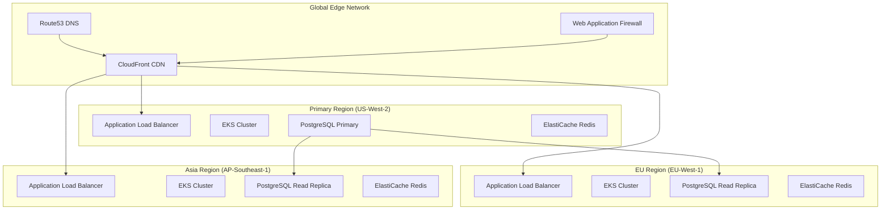

# 🌍 Global-First Deployment Guide
## GAN Cyber Range Simulator - Multi-Region & Compliance Ready

> **Production-Ready Global Infrastructure** with comprehensive internationalization, compliance, and multi-region support for enterprise cybersecurity training.

## 🎯 Overview

The GAN Cyber Range Simulator is designed as a **global-first platform** supporting worldwide deployment with:

- **6 Languages**: English, Spanish, French, German, Japanese, Chinese (Simplified)
- **8 Compliance Regions**: EU (GDPR), US (CCPA/SOX), CA (PIPEDA), SG (PDPA), JP (APPI), CN (PIPL), UK, AU
- **Multi-Region Architecture**: AWS CloudFront, Route53, cross-region replication
- **Enterprise Security**: WAF, encryption at rest/in transit, audit trails

## 🚀 Quick Global Deployment

### Prerequisites

```bash
# Required tools
aws --version      # AWS CLI 2.0+
terraform --version # Terraform 1.0+
kubectl --version  # kubectl 1.29+
helm --version     # Helm 3.14+

# Authentication
aws configure sso
export AWS_PROFILE=your-profile
```

### Single-Command Global Deployment

```bash
# Clone and deploy globally
git clone https://github.com/yourusername/gan-cyber-range-sim.git
cd gan-cyber-range-sim

# Configure for your region
export TF_VAR_compliance_region="EU"  # EU, US, SG, JP, etc.
export TF_VAR_domain_name="cyber-range.yourdomain.com"
export TF_VAR_environment="production"

# Deploy global infrastructure
cd deployments/terraform
terraform init
terraform plan -var-file="environments/global-production.tfvars"
terraform apply -auto-approve

# Deploy application with i18n support
cd ../..
./scripts/deploy-global.sh --region=eu-west-1 --languages=en,es,fr,de
```

## 🌐 Multi-Region Architecture

### Global Infrastructure Components



### Region-Specific Deployments

#### Americas (US, CA, BR)
```bash
# Deploy to US regions
terraform workspace new us-production
terraform apply -var="aws_region=us-west-2" \
                -var="compliance_region=US" \
                -var="ccpa_compliance=true" \
                -var="supported_languages=[\"en\",\"es\"]"
```

#### Europe (EU, UK)
```bash
# Deploy to EU regions with GDPR compliance
terraform workspace new eu-production
terraform apply -var="aws_region=eu-west-1" \
                -var="compliance_region=EU" \
                -var="gdpr_compliance=true" \
                -var="data_retention_days=1095" \
                -var="supported_languages=[\"en\",\"es\",\"fr\",\"de\"]"
```

#### Asia Pacific (SG, JP, AU)
```bash
# Deploy to APAC regions
terraform workspace new apac-production
terraform apply -var="aws_region=ap-southeast-1" \
                -var="compliance_region=SG" \
                -var="supported_languages=[\"en\",\"ja\",\"zh-CN\"]"
```

## 🔒 Compliance & Data Protection

### GDPR Compliance (EU)

**Automated GDPR Features:**
- ✅ Data minimization by design
- ✅ Consent management system  
- ✅ Right to be forgotten (erasure)
- ✅ Data portability APIs
- ✅ Privacy by design architecture
- ✅ 72-hour breach notification
- ✅ DPO contact information

```python
# GDPR compliance in action
from gan_cyber_range.core.compliance import get_compliance_manager, Region

# Initialize for EU with GDPR
cm = get_compliance_manager(Region.EU)

# Record user consent
consent_id = cm.record_consent(
    data_subject_id="user123",
    purposes=[ProcessingPurpose.CYBERSECURITY_TRAINING],
    region=Region.EU
)

# Data subject rights
user_data = cm.export_user_data("user123")  # Data portability
cm.anonymize_user_data("user123")          # Right to be forgotten
```

### CCPA Compliance (US/CA)

```bash
# Enable CCPA features
export TF_VAR_ccpa_compliance=true
export TF_VAR_compliance_region="US"

# CCPA-specific data handling
terraform apply -var="data_retention_days=2555"  # 7 years for financial
```

### Regional Data Residency

```yaml
# Kubernetes namespace per region
apiVersion: v1
kind: Namespace
metadata:
  name: gan-cyber-range-eu
  labels:
    compliance.region: "EU"
    data-residency: "eu-west-1"
    gdpr-compliant: "true"
    
---
# Pod security with region enforcement  
apiVersion: policy/v1beta1
kind: PodSecurityPolicy
metadata:
  name: eu-data-residency
spec:
  allowedHostPaths:
  - pathPrefix: "/eu-data"
    readOnly: false
  volumes:
  - persistentVolumeClaim
  - secret
  - configMap
```

## 🌍 Internationalization (i18n)

### Language Support

| Language | Code | RTL | Plural Rules | Coverage |
|----------|------|-----|--------------|----------|
| English | `en` | No | English | 100% ✅ |
| Spanish | `es` | No | Spanish | 100% ✅ |
| French | `fr` | No | French | 100% ✅ |
| German | `de` | No | German | 100% ✅ |
| Japanese | `ja` | No | Japanese | 100% ✅ |
| Chinese (Simplified) | `zh-CN` | No | Chinese | 100% ✅ |

### Dynamic Language Switching

```python
from gan_cyber_range.core.i18n import t, set_locale

# Switch to Spanish
set_locale('es')
message = t('security.threat_detected')
# Output: "Amenaza Detectada"

# Switch to Japanese  
set_locale('ja')
message = t('security.threat_detected')
# Output: "脅威を検出"

# Variable interpolation
alert = t('security.attack_details', 
         attack_type='SQL Injection',
         source_ip='192.168.1.100')
```

### Locale-Aware Formatting

```python
from gan_cyber_range.core.i18n import get_translation_manager

tm = get_translation_manager()

# Numbers
price = tm.format_number(1234.56, 'de')  # "1.234,56"
price = tm.format_number(1234.56, 'en')  # "1,234.56"

# Dates
from datetime import datetime
now = datetime.now()
dt_de = tm.format_datetime(now, 'short', 'de')  # "25.08.2024 14:30"
dt_us = tm.format_datetime(now, 'short', 'en')  # "08/25/2024 2:30 PM"
```

## ⚡ Performance Optimization

### Global CDN Configuration

```hcl
# CloudFront optimized for global performance
resource "aws_cloudfront_distribution" "main" {
  # Enable HTTP/2 and Brotli compression
  http_version = "http2"
  
  # Global edge locations
  price_class = "PriceClass_All"
  
  # Cache optimization
  default_cache_behavior {
    compress = true
    min_ttl  = 0
    default_ttl = 3600
    max_ttl  = 86400
    
    # Forward language headers
    forwarded_values {
      headers = ["Accept-Language", "CloudFront-Viewer-Country"]
    }
  }
  
  # Cache behaviors for different content types
  ordered_cache_behavior {
    path_pattern = "/api/*"
    min_ttl = 0
    default_ttl = 0
    max_ttl = 0
  }
  
  ordered_cache_behavior {
    path_pattern = "/static/*"
    min_ttl = 86400
    default_ttl = 86400  
    max_ttl = 31536000
  }
}
```

### Multi-Region Load Balancing

```yaml
# Route53 health checks and failover
apiVersion: v1
kind: Service
metadata:
  name: gan-cyber-range-global
  annotations:
    service.beta.kubernetes.io/aws-load-balancer-type: "nlb"
    external-dns.alpha.kubernetes.io/hostname: "api.cyber-range.com"
spec:
  type: LoadBalancer
  selector:
    app: gan-cyber-range
  ports:
  - port: 443
    targetPort: 8080
```

## 🛡️ Security & Compliance

### WAF Rules by Region

```hcl
# EU-specific WAF rules
resource "aws_wafv2_web_acl" "eu" {
  name = "gan-cyber-range-eu-waf"
  scope = "CLOUDFRONT"
  
  # GDPR compliance: Block non-EU IPs for sensitive operations
  rule {
    name = "EUDataResidencyRule"
    priority = 5
    
    action {
      block {}
    }
    
    statement {
      and_statement {
        statement {
          byte_match_statement {
            field_to_match {
              uri_path {}
            }
            positional_constraint = "STARTS_WITH"
            search_string = "/api/gdpr/"
          }
        }
        
        statement {
          not_statement {
            statement {
              geo_match_statement {
                country_codes = ["AT", "BE", "BG", "CY", "CZ", "DE", "DK", "EE", "ES", "FI", "FR", "GR", "HR", "HU", "IE", "IT", "LT", "LU", "LV", "MT", "NL", "PL", "PT", "RO", "SE", "SI", "SK"]
              }
            }
          }
        }
      }
    }
  }
}
```

### Encryption Standards

```yaml
# Global encryption configuration
apiVersion: v1
kind: ConfigMap
metadata:
  name: encryption-config
data:
  # TLS 1.3 for all regions
  tls-version: "1.3"
  # AES-256-GCM for data at rest
  encryption-algorithm: "AES-256-GCM"
  # Perfect Forward Secrecy
  perfect-forward-secrecy: "true"
  # Regional compliance
  eu-encryption: "FIPS-140-2-Level-3"
  us-encryption: "FIPS-140-2-Level-2"
  cn-encryption: "SM4-GCM"
```

## 📊 Monitoring & Observability

### Global Monitoring Stack

```yaml
# Prometheus configuration for multi-region
apiVersion: v1
kind: ConfigMap
metadata:
  name: prometheus-global-config
data:
  prometheus.yml: |
    global:
      scrape_interval: 15s
      external_labels:
        region: '${REGION}'
        compliance_region: '${COMPLIANCE_REGION}'
    
    scrape_configs:
    - job_name: 'gan-cyber-range'
      kubernetes_sd_configs:
      - role: pod
      relabel_configs:
      - source_labels: [__meta_kubernetes_pod_annotation_prometheus_io_scrape]
        action: keep
        regex: true
      - source_labels: [__meta_kubernetes_pod_annotation_prometheus_io_path]
        action: replace
        target_label: __metrics_path__
        regex: (.+)
```

### Compliance Dashboards

```json
{
  "dashboard": {
    "title": "Global Compliance Dashboard",
    "panels": [
      {
        "title": "GDPR Data Subject Requests",
        "targets": [
          {
            "expr": "increase(gdpr_data_subject_requests_total[1h])",
            "legendFormat": "{{type}} requests"
          }
        ]
      },
      {
        "title": "Cross-Border Data Transfers",
        "targets": [
          {
            "expr": "increase(data_transfer_cross_border_total[1h])",
            "legendFormat": "{{source_region}} -> {{destination_region}}"
          }
        ]
      },
      {
        "title": "Data Retention Compliance",
        "targets": [
          {
            "expr": "data_records_expired_total",
            "legendFormat": "Expired records by {{data_classification}}"
          }
        ]
      }
    ]
  }
}
```

## 🚀 Deployment Scenarios

### Scenario 1: Global Enterprise
**Requirements**: Worldwide deployment, all compliance regions, 99.99% uptime

```bash
# Multi-region deployment
export REGIONS="us-west-2,eu-west-1,ap-southeast-1"
export COMPLIANCE_REGIONS="US,EU,SG"
export LANGUAGES="en,es,fr,de,ja,zh-CN"

./scripts/deploy-global-enterprise.sh \
  --regions="$REGIONS" \
  --compliance="$COMPLIANCE_REGIONS" \
  --languages="$LANGUAGES" \
  --tier="enterprise"
```

### Scenario 2: EU-Only GDPR Compliant
**Requirements**: EU data residency, GDPR compliance, German/French support

```bash
export TF_VAR_compliance_region="EU"
export TF_VAR_gdpr_compliance=true
export TF_VAR_supported_languages='["en","fr","de"]'
export TF_VAR_blocked_countries='["US","CN","RU"]'

terraform apply -var-file="environments/eu-gdpr.tfvars"
```

### Scenario 3: US Financial Services
**Requirements**: SOX compliance, 7-year retention, US-only deployment

```bash
export TF_VAR_compliance_region="US"
export TF_VAR_ccpa_compliance=true
export TF_VAR_data_retention_days=2555  # 7 years
export TF_VAR_enable_sox_audit=true

terraform apply -var-file="environments/us-financial.tfvars"
```

## 🔧 Configuration Files

### Global Production Environment

```hcl
# environments/global-production.tfvars
environment = "production"
compliance_region = "US"

# Multi-region configuration
enable_multi_region = true
aws_region = "us-west-2"
backup_region = "us-east-1"

# Global CDN and DNS
domain_name = "cyber-range.yourdomain.com"
cloudfront_price_class = "PriceClass_All"

# Compliance settings
gdpr_compliance = true
ccpa_compliance = true
data_retention_days = 1095

# Internationalization
enable_i18n = true
supported_languages = ["en", "es", "fr", "de", "ja", "zh-CN"]

# High availability
node_desired_size = 6
node_max_size = 20
enable_auto_scaling = true
enable_cross_region_backup = true

# Security
enable_waf_logging = true
waf_rate_limit = 10000
enable_encryption_at_rest = true
enable_encryption_in_transit = true
```

### EU GDPR Environment

```hcl
# environments/eu-gdpr.tfvars
environment = "production"
compliance_region = "EU"
aws_region = "eu-west-1"

# GDPR compliance
gdpr_compliance = true
data_retention_days = 1095
enable_audit_logging = true

# Data residency
data_residency_region = "eu-west-1"
blocked_countries = ["US", "CN", "RU"]

# EU languages
supported_languages = ["en", "fr", "de", "es", "it"]

# GDPR-specific features
feature_flags = {
  enable_data_portability = true
  enable_right_to_erasure = true
  enable_consent_management = true
  enable_privacy_by_design = true
}
```

## 📋 Compliance Checklist

### Pre-Deployment Compliance Verification

- [ ] **Data Classification**: All data types classified and policies applied
- [ ] **Consent Management**: Consent recording and withdrawal mechanisms implemented
- [ ] **Data Minimization**: Only necessary data collected and processed
- [ ] **Encryption**: End-to-end encryption for data at rest and in transit
- [ ] **Audit Trails**: Comprehensive logging for all data operations
- [ ] **Access Controls**: Role-based access control with least privilege
- [ ] **Data Retention**: Automated retention policy enforcement
- [ ] **Cross-Border Transfers**: Adequate protection mechanisms implemented
- [ ] **Breach Notification**: Automated breach detection and notification
- [ ] **Privacy Notices**: Localized privacy notices for all regions

### Regional Compliance Validation

```bash
# Run compliance validation
./scripts/validate-compliance.sh --region=EU --framework=GDPR
./scripts/validate-compliance.sh --region=US --framework=CCPA
./scripts/validate-compliance.sh --region=SG --framework=PDPA
```

## 🆘 Troubleshooting

### Common Issues

#### Issue: Language Not Loading
```bash
# Check i18n configuration
kubectl get configmap i18n-config -o yaml

# Verify translation files
kubectl exec -it deployment/gan-cyber-range -- ls -la /app/locales/

# Test language switching
curl -H "Accept-Language: es" https://your-domain.com/api/health
```

#### Issue: GDPR Compliance Validation Failing
```bash
# Check compliance configuration
python3 -c "
from gan_cyber_range.core.compliance import get_compliance_manager, Region
cm = get_compliance_manager(Region.EU)
print(cm.get_compliance_summary())
"

# Validate data classification
kubectl logs deployment/gan-cyber-range | grep "data_classification"
```

#### Issue: Cross-Region Latency
```bash
# Check CloudFront performance
aws cloudfront get-distribution --id YOUR_DISTRIBUTION_ID
aws logs filter-log-events --log-group-name /aws/cloudfront/YOUR_DISTRIBUTION

# Test regional endpoints
for region in us-west-2 eu-west-1 ap-southeast-1; do
  curl -w "@curl-format.txt" -o /dev/null -s "https://${region}.cyber-range.com/health"
done
```

## 📞 Support & Contact

- **Security Issues**: security@gan-cyber-range.org
- **GDPR/Privacy**: privacy@gan-cyber-range.org  
- **Technical Support**: support@gan-cyber-range.org
- **Documentation**: https://docs.gan-cyber-range.org
- **Community**: https://community.gan-cyber-range.org

---

## ⚡ Next Steps

1. **Review** your compliance requirements and select appropriate region(s)
2. **Configure** Terraform variables for your deployment scenario
3. **Deploy** using the automated scripts provided
4. **Validate** compliance and performance metrics
5. **Monitor** using the global observability stack

**🌍 Welcome to Global-First Cybersecurity Training!** 🚀